# MoBi Multi-Omics Analysis using AML Dataset

[](https://www.r-project.org/)
[](https://bioconductor.org/)
[]()

---

## Table of Contents
1. [Project Overview](#project-overview)
2. [Dataset Description](#dataset-description)
3. [Repository Structure](#repository-structure)
4. [Methods](#methods)
5. [Results & Figure Interpretations](#results--figure-interpretations)
6. [Conclusions](#conclusions)
7. [Limitations](#limitations)
8. [Reproducibility](#reproducibility)
9. [Dependencies](#dependencies)

---

## Project Overview

This project presents a fully reproducible **multi-omics integrative analysis** of an Acute Myeloid Leukaemia (AML) patient cohort. Three molecular layers are jointly analysed:

- 🧬 **RNA-seq** — bulk transcriptomic profiles (gene expression counts)
- 🔬 **Targeted gene mutations** — binary somatic mutation calls across a curated AML panel
- 💊 **Ex vivo drug response** — area-under-the-curve (AUC) pharmacological sensitivity profiles

The analysis first characterises each omics layer independently through preprocessing, dimensionality reduction (PCA + UMAP), and metadata association testing. It then integrates all three layers using **MOFA2 (Multi-Omics Factor Analysis v2)** to discover shared and view-specific sources of variation across patients.

---

## Dataset Description

| File | Description | Format |
|------|-------------|--------|
| `rnacount.tsv` | Gene-by-sample raw count matrix | Feature × Sample |
| `genemutation.tsv` | Long-format binary mutation calls (sample, gene, value) | Long table |
| `drugauc.tsv` | Long-format inhibitor AUC measurements (sample, inhibitor, AUC) | Long table |
| `metadata.tsv` | Clinical & sample-level annotations | Sample × Variable |

**Key clinical variables:** specimen type, vital status, disease stage, induction therapy response, age, white blood cell count, FLT3-ITD status, NPM1 mutation status, sex, ethnicity, processing centre ID.


---


## Repository Structure

multi_omics_report/
├── rnacount.tsv
├── genemutation.tsv
├── drugauc.tsv
├── metadata.tsv
├── MoBi_MultiOmic_4745778_Chua.Rmd
├── MoBi_MultiOmic_4745778_Chua.html
├── make_MoBi_MultiOmic_4745778_Chua_report.R
├── MoBiMultiOmic4745778Chua_mofamodel.hdf5
└── MoBi_MultiOmic_4745778_Chua_files/
└── figure-html/


---
## Methods

### 1. Data Loading & Quality Control

All four input files are loaded from the working directory. Sample identifiers are harmonised across tables and checked for consistency. A **sample overlap matrix** is constructed to determine which samples are available in each omics layer and their union/intersection sizes. Identifier mismatches are distinguished from genuine assay missingness.

> **Design decision:** Rather than restricting analyses to complete-case samples, MOFA is run on the **union** of all sample IDs. Samples missing an entire view are represented with `NA` blocks — MOFA can still learn from partially observed samples.

### 2. RNA-seq Preprocessing (DESeq2)

1. **Duplicate gene symbols** collapsed by summing counts
2. **Low-expression filter** — genes must have count ≥ 10 in at least 5% of samples
3. **DESeq2 size-factor normalisation** — corrects for sequencing depth differences
4. **Variance-Stabilising Transformation (VST)** — reduces mean-variance dependency intrinsic to count data
5. **Highly Variable Gene (HVG) selection** — top 2,000 genes by post-VST variance retained for PCA and MOFA

> Raw counts are **not** used directly for PCA or MOFA because they are discrete, heteroscedastic, and library-size-confounded. VST-transformed HVGs provide a continuous, homoscedastic representation appropriate for Gaussian latent factor models.

### 3. Mutation Preprocessing

1. Long-format mutation table reshaped into a **binary gene × sample matrix** (1 = mutated, 0 = absent)
2. Duplicate sample-gene entries resolved by taking the maximum
3. Genes mutated in ≤ 1 sample removed (recurrence filter)
4. Sparse binary matrix passed to PCA (with feature scaling) and to MOFA with a **Bernoulli likelihood**

> Mutation data are modelled with Bernoulli likelihood in MOFA because mutation calls are discrete events. Sparsity means mutation PCs are driven by recurrent driver events (e.g., NPM1, FLT3-ITD) rather than a continuous burden gradient.

### 4. Drug AUC Preprocessing

1. Inhibitors missing in > 20% of samples excluded
2. Remaining missing values **row-mean imputed** for PCA and display only
3. Values **row-centred and scaled** before PCA
4. MOFA retains original missing values using a **Gaussian likelihood**

> Lower AUC = greater drug sensitivity. Higher AUC = resistance. AUC values are continuous and modelled with Gaussian likelihood in MOFA.

### 5. Single-Omics PCA & UMAP

Independent PCA is performed on each preprocessed view using `prcomp`. UMAP embeddings are computed from the first 10 PCs using `uwot::umap` (15 nearest neighbours, min_dist = 0.25). A **Mutual Nearest Neighbour (MNN) graph** is built in drug PCA space (k=10) with Louvain community detection via `igraph` to identify drug-response subgroups.

### 6. MOFA2 Multi-Omics Factor Analysis

MOFA2 is trained on all three views aligned to the union sample set:

| View | Features | Likelihood |
|------|----------|------------|
| RNAseq | Top 2,000 HVGs (row-centred/scaled) | Gaussian |
| Mutations | Filtered binary gene panel | Bernoulli |
| DrugAUC | Filtered AUC matrix (row-centred/scaled) | Gaussian |

**Training settings:** Factors = min(8, n_samples − 1) · Max iterations = 600 · Convergence = medium · Seed = 4745778 · Python backend = isolated `.venvmofa` with `mofapy2`. The trained model is saved as `.hdf5` and reloaded on subsequent renders if the sample/view configuration matches.

### 7. Statistical Association Testing

| Variable type | Test | Estimate reported |
|--------------|------|------------------|
| Categorical (≤ 8 groups) | One-way ANOVA | η² — fraction of score variance explained |
| Continuous | ANOVA linear model | Slope coefficient |
| Categorical (sensitivity check) | Kruskal-Wallis | Test statistic H |

All p-values are BH-adjusted across all component × metadata pairs. Kruskal-Wallis serves as a non-parametric sensitivity check alongside ANOVA — concordance between both tests strengthens interpretation; discordance warrants caution.

---

## Results & Figure Interpretations

### Sample Overlap

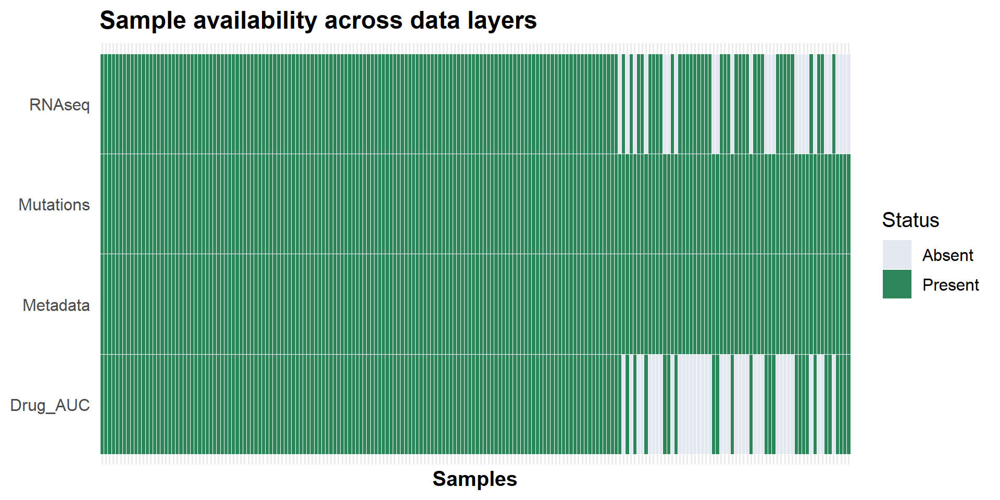

The tile heatmap shows which samples have measurements in each data layer. Most samples have RNA-seq, mutation, and metadata entries. The drug-response row shows the most systematic missingness — this is the bottleneck for complete-case integration. The structured absence pattern confirms assay-level missingness rather than scattered data loss, justifying the union-sample MOFA approach rather than discarding incomplete cases.

---

### RNA-seq Analysis

**Library Size Distribution**

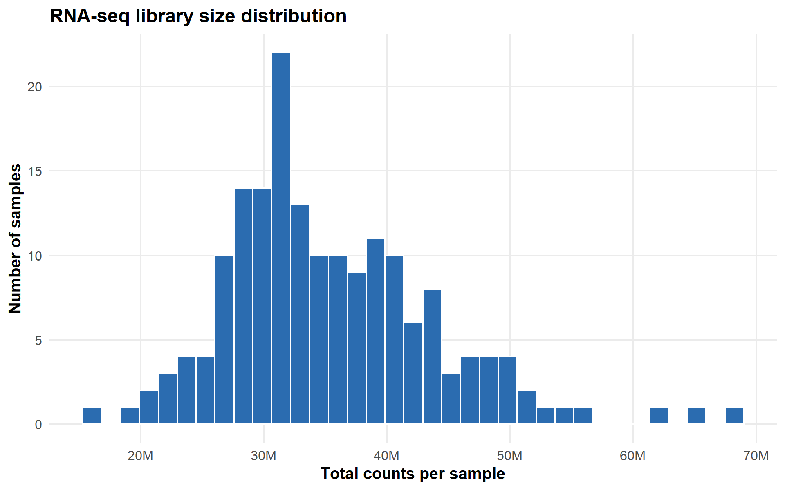

Substantial sequencing-depth variation is visible across samples. This confirms the necessity of DESeq2 size-factor normalisation before any distance-based analysis — without it, deeply sequenced samples would appear artificially distinct from shallow-sequenced ones regardless of their biological profiles.

**Raw Count Distribution**

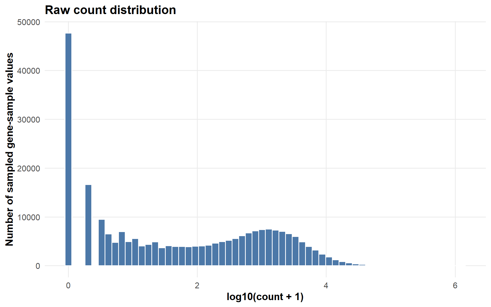

The raw count distribution is strongly right-skewed even after log10(count + 1) transformation. The large spike near zero reflects the high proportion of zero or near-zero gene-sample entries. This motivates both the low-expression filter and the variance-stabilising transformation before multivariate analysis.

**Mean–Variance Relationship After VST**

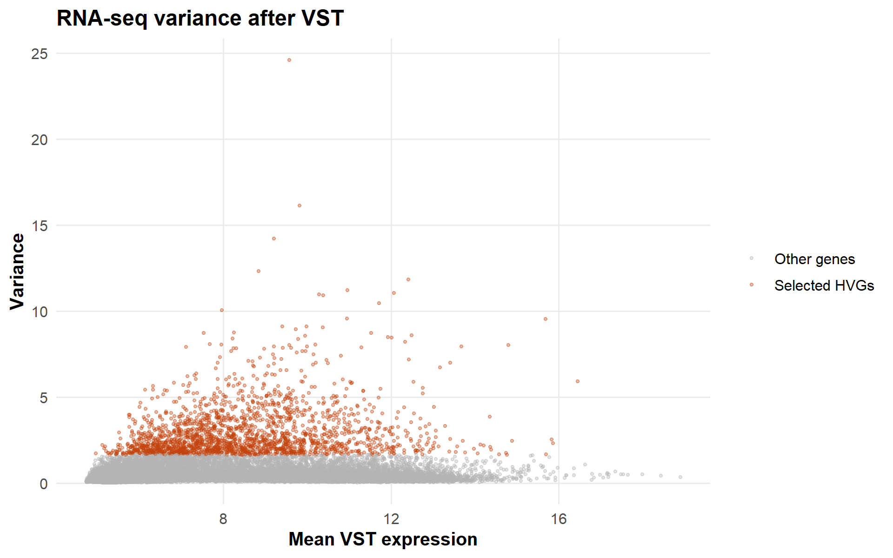

After DESeq2 VST, the strong mean-dependent variance seen in raw counts is substantially reduced. Orange points are the 2,000 selected HVGs — genes that retain genuine biological variability across patients after normalisation. These genes exclusively drive PCA and the MOFA RNA view, ensuring that the multivariate analyses reflect biology rather than sequencing noise.

**RNA-seq Heatmap (Top Variable Genes)**

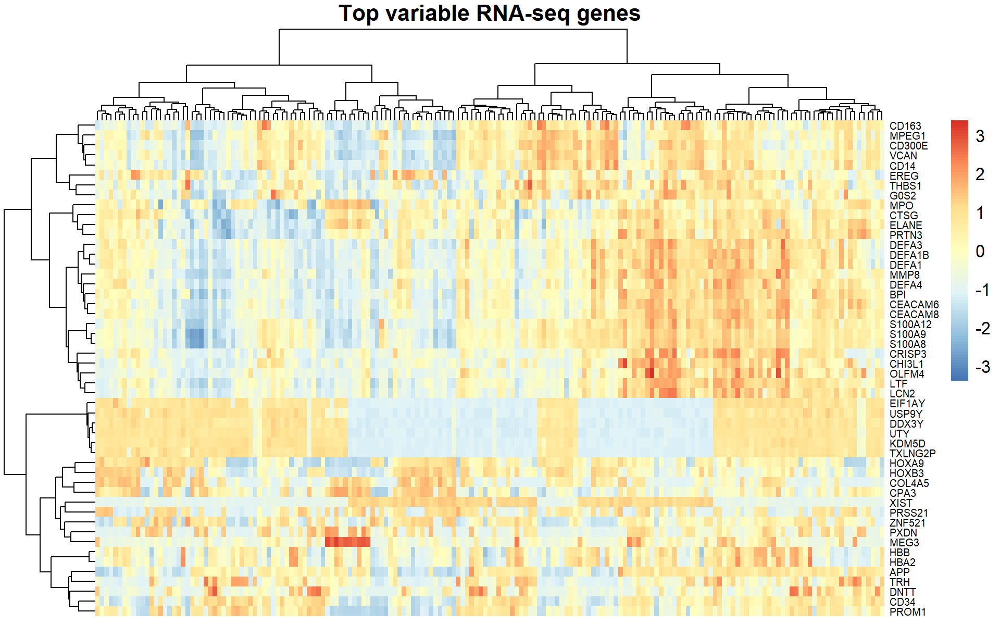

Row-scaled heatmap of the 50 most variable genes with Ward D2 hierarchical clustering. Coordinated expression blocks across patient subgroups are clearly visible. Multiple co-expression patterns are consistent with the gradual RNA scree curve — AML transcriptional variation is distributed across several programmes rather than a single dominant binary split between patient groups.

**RNA-seq PCA (PC1 vs PC2)**

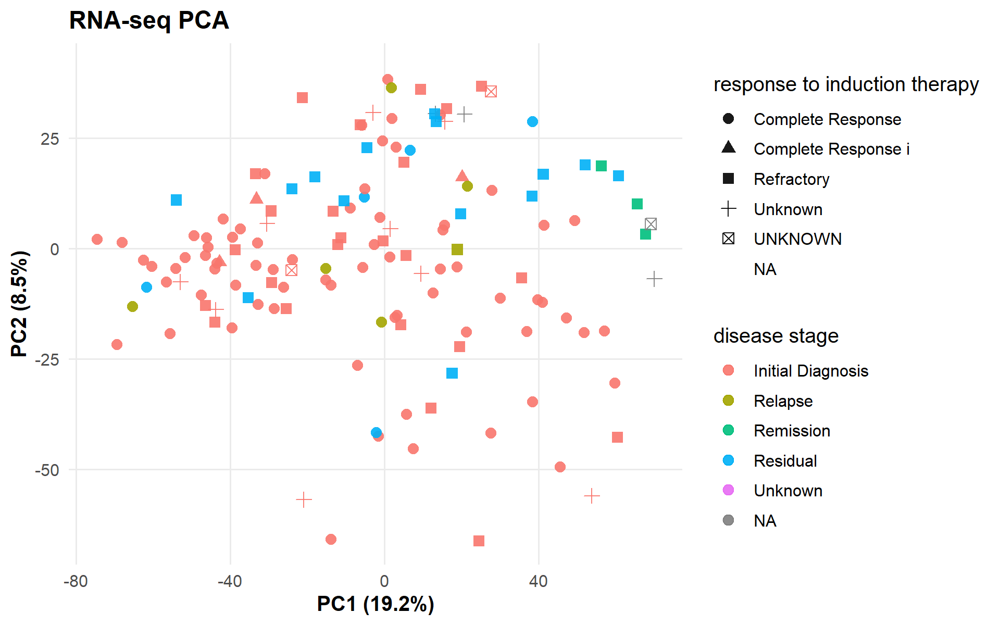

The PCA plot reveals sample-level transcriptional structure, with points coloured by the most informative metadata variable selected automatically. Samples near the periphery of the PC1–PC2 plane may represent strong biological states (e.g., specific AML subtypes) or technical outliers worth investigating. Overlapping groups indicate that dominant expression gradients are continuous or multi-factorial rather than cleanly separating clinical categories.

**RNA-seq Scree Plot**

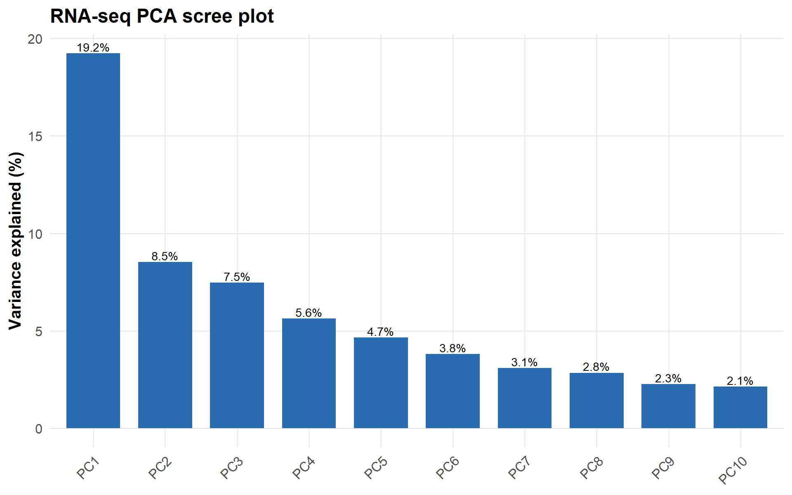

The gradual decline in variance explained from PC1 to PC10 confirms that RNA-seq variation in this AML cohort is distributed across multiple independent expression programmes. This contrasts with datasets dominated by a single axis such as a major cell-type gradient, and is the core transcriptomic justification for multi-factor integration with MOFA.

**RNA-seq PCA Metadata Association Heatmap**

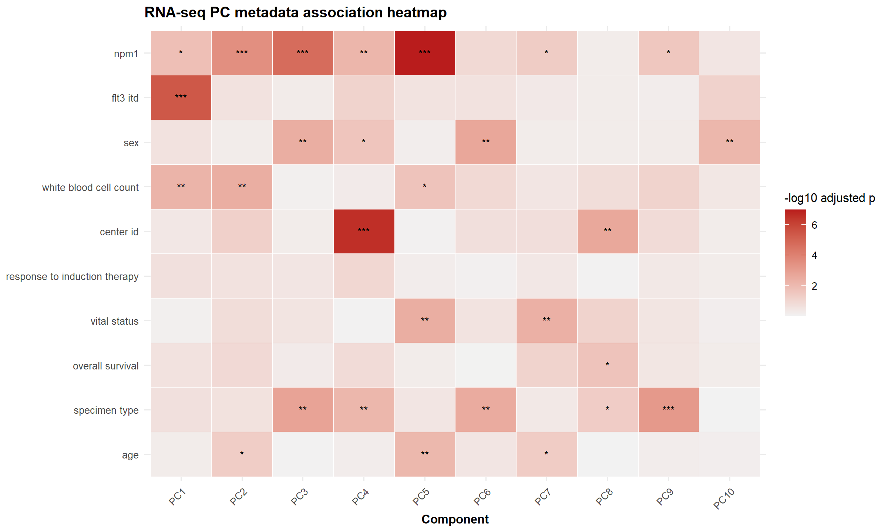

Darker red tiles indicate stronger BH-adjusted evidence that a metadata variable explains a given PC score. Variables appearing dark across multiple PCs exert broad transcriptome-wide effects. This heatmap should be read alongside the scree plot — a strong association on PC1 carries substantially greater biological weight than the same p-value on PC8, which explains a much smaller fraction of total variance.

**RNA-seq PCA Coloured by Centre**

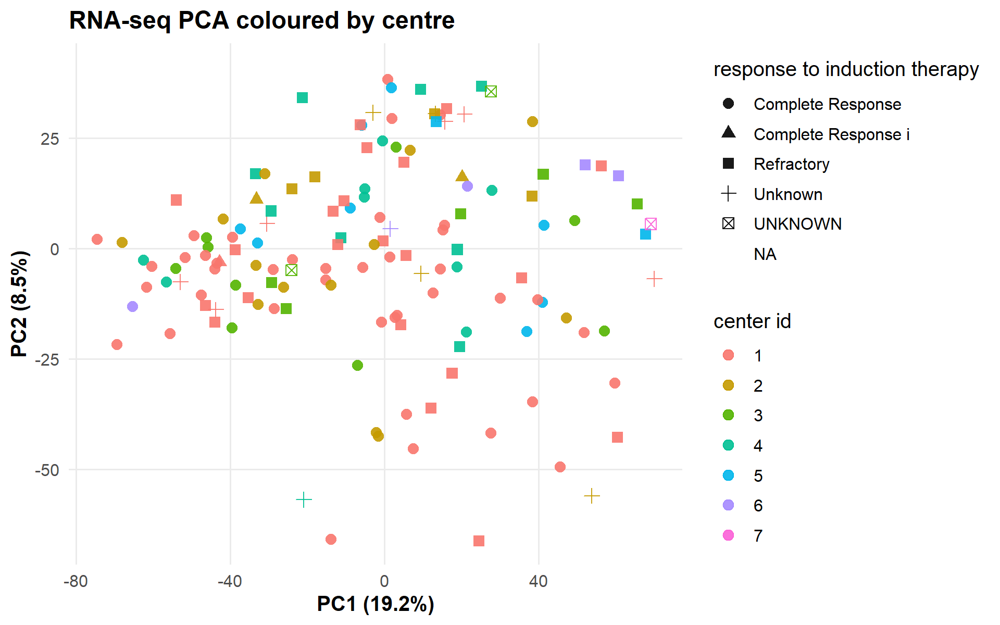

This plot directly interrogates potential batch effects from different processing centres. If samples from one centre cluster separately along a PC axis, that component may partly reflect technical rather than biological variation. Strong overlap of centre colours across the PC space indicates that centre-related batch effects are not the dominant source of RNA variation in this dataset.

**RNA-seq UMAP**

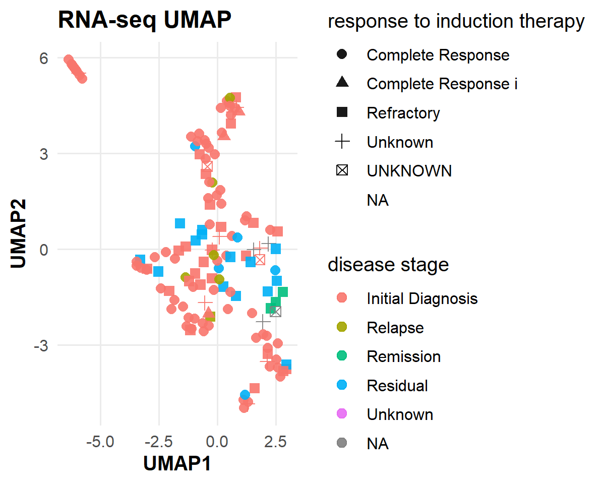

The RNA UMAP projects the first 10 RNA-seq PCs into 2D using a nearest-neighbour graph. Compact clusters indicate groups of samples with highly similar transcriptional profiles. The UMAP1–PC1 correlation coefficient reported alongside this figure quantifies how much of the embedding reflects the leading linear gradient versus higher-order neighbourhood structure beyond the first PC.

---

### Mutation Analysis

**Most Frequently Mutated Genes**

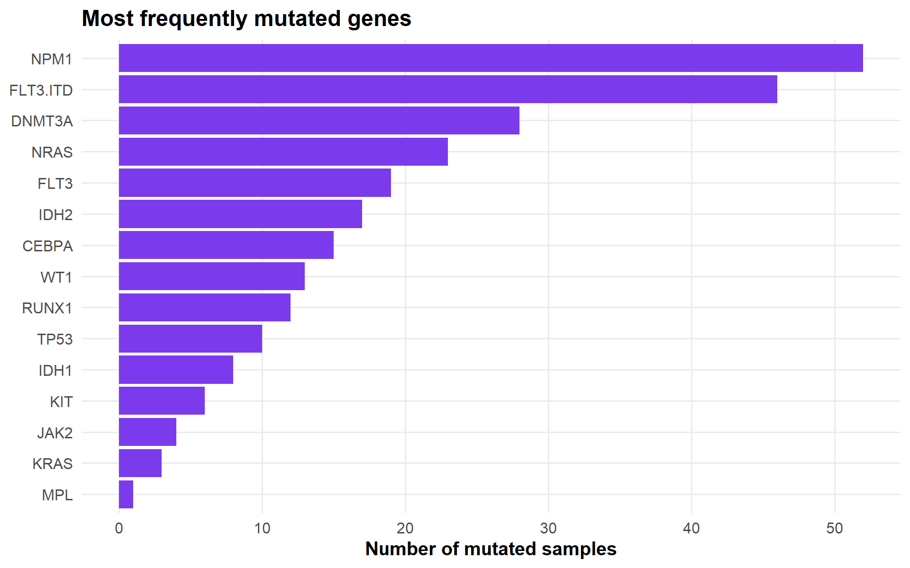

Mutation signal in this AML targeted panel is heavily concentrated in a small number of recurrent driver genes. NPM1 and FLT3-ITD-related events are among the most common, consistent with their well-established prevalence in AML (~30% and ~25% of cases respectively). Less common mutations represent secondary or cooperating events in leukaemogenesis.

**Mutation Burden per Sample**

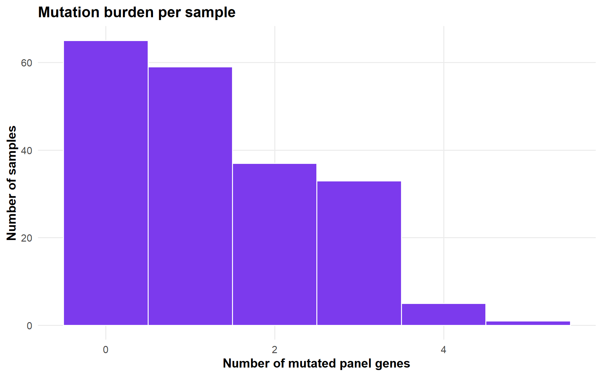

Most samples carry only 1–3 mutations in this targeted panel, and a substantial fraction carry none of the encoded events. The low median burden reflects that targeted panels capture known recurrent hotspots rather than the full somatic landscape. This sparsity makes Bernoulli likelihood modelling in MOFA the appropriate choice over a Gaussian assumption.

**Binary Mutation Heatmap**

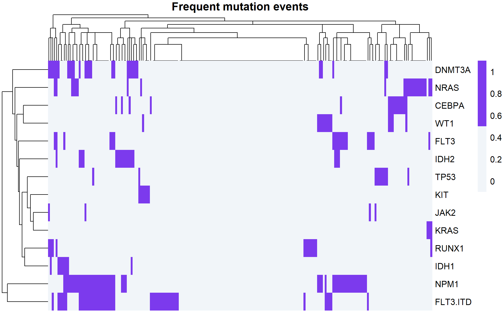

Purple cells indicate mutation presence; light grey indicates absence. Dense bands for top-frequency genes such as NPM1 and FLT3 confirm sparse, event-based mutation structure across the cohort. Co-mutation patterns are visible as paired purple blocks appearing in the same patient columns for some gene combinations, reflecting known co-occurring AML driver events.

**Mutation PCA (PC1 vs PC2)**

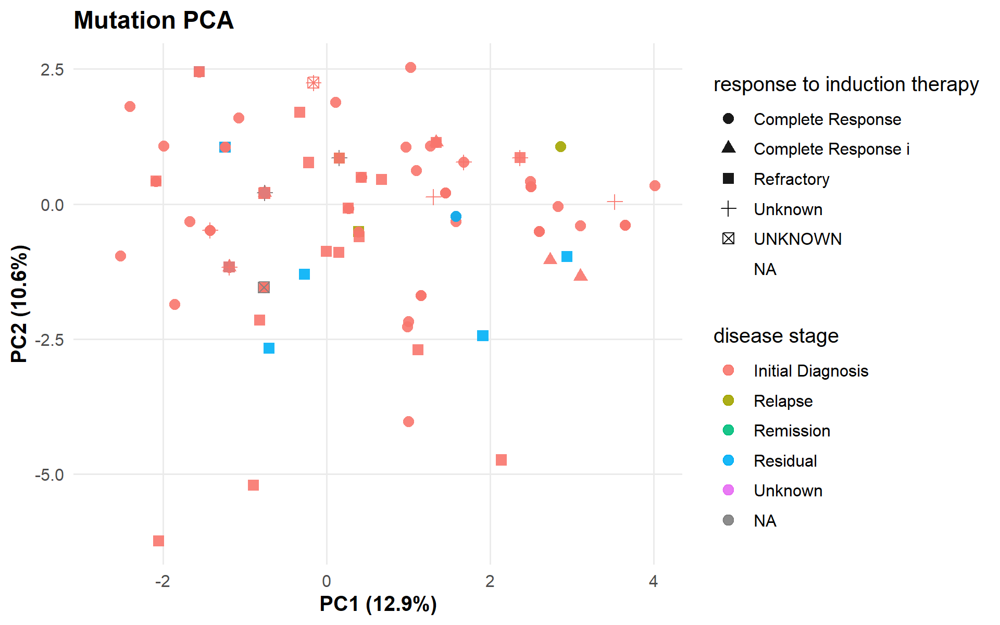

PCA on the binary mutation matrix separates samples primarily by recurrent genotype events. PC1 and PC2 together explain a lower fraction of total variance compared to RNA-seq, which is expected — each gene defines a partly independent binary axis rather than a continuous gradient, so mutation variance is distributed across many components.

**Mutation Scree Plot**

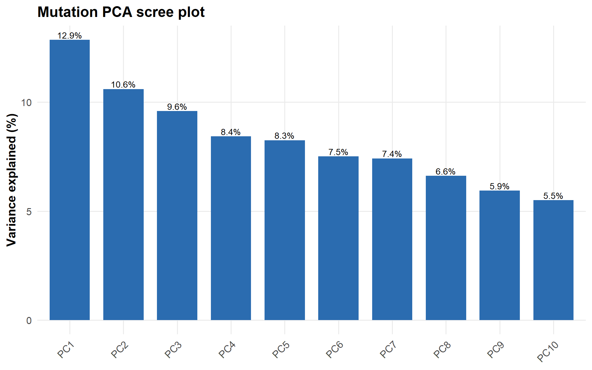

The relatively flat mutation scree plot indicates that multiple PCs each carry meaningful genotype information. This is expected given that NPM1, FLT3-ITD, DNMT3A, NRAS, and other recurrent events define partly independent patient subgroups. Mutation variation therefore does not collapse onto a single dominant axis the way a strong continuous signal might.

**Mutation PCA Metadata Association Heatmap**

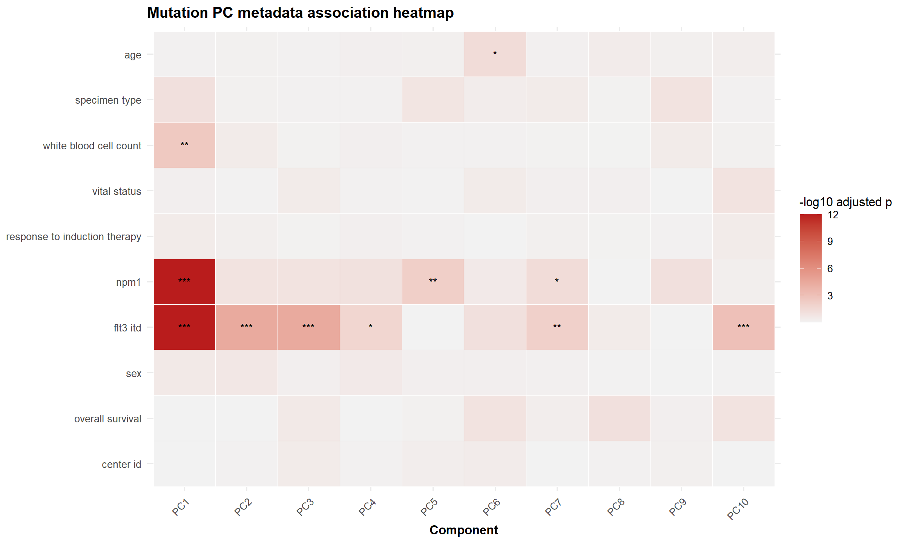

If NPM1 or FLT3-ITD metadata variables appear in the darkest tiles, this supports the interpretation that the mutation PCs capture genuine genotype axes. Associations with specimen type or processing centre would instead suggest technical confounders rather than biological mutation structure.

**Mutation UMAP**

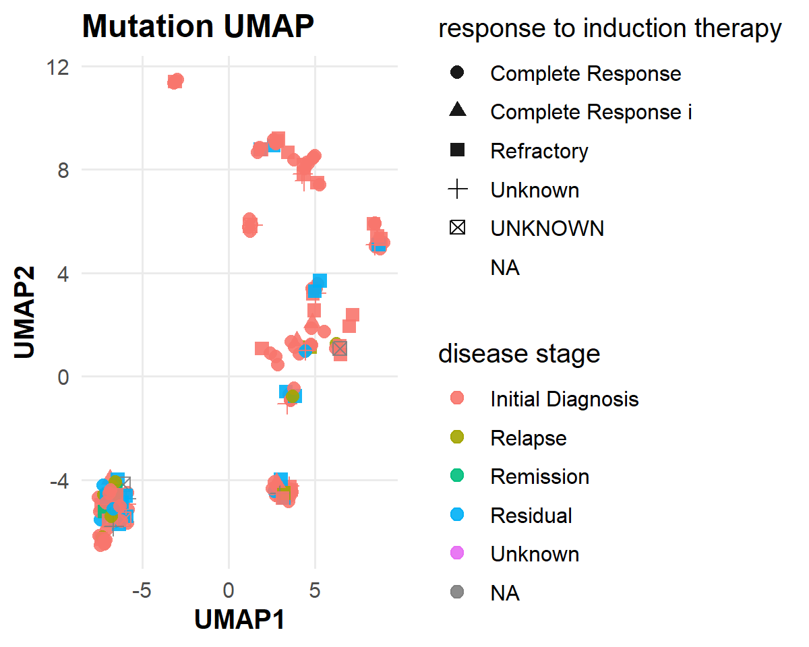

The mutation UMAP reveals whether mutation-defined patient groups form discrete islands in 2D space. Compact, well-separated clusters correspond to dominant genotype combinations such as NPM1+/FLT3+ versus NPM1−/FLT3−. Diffuse layouts indicate that mutation-based patient grouping is gradual rather than dichotomous at this resolution.

---

### Drug Response Analysis

**Drug AUC Density**

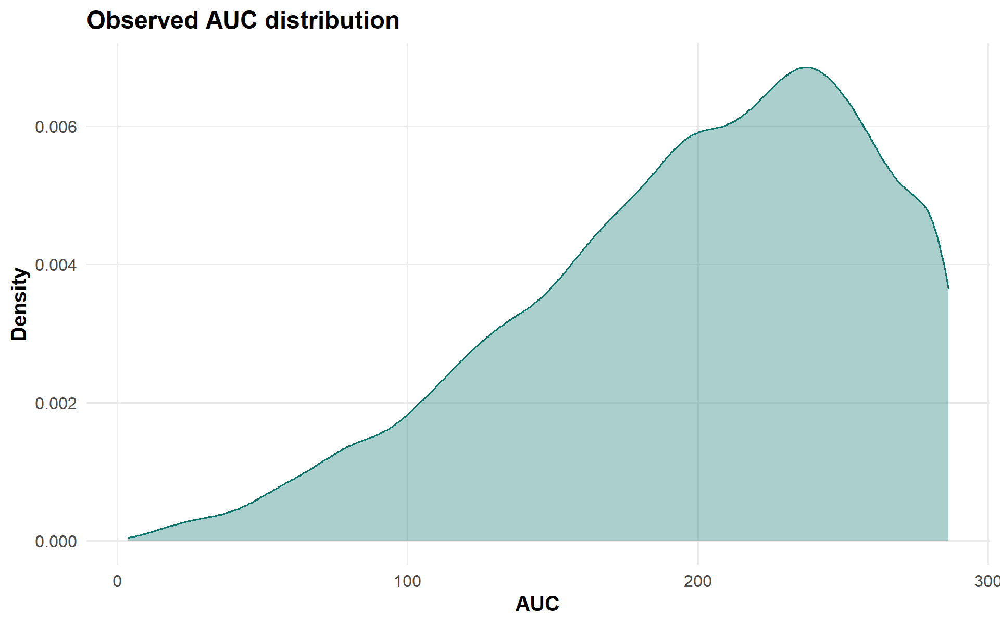

The distribution of AUC values across all inhibitor-sample pairs characterises the overall pharmacological sensitivity profile of the cohort. AUC values close to 1 indicate resistance (high cell viability at all tested concentrations); values close to 0 indicate sensitivity. The shape of this distribution reflects whether the cohort is broadly resistant, broadly sensitive, or bimodally distributed across drugs.

**Drug Heatmap**

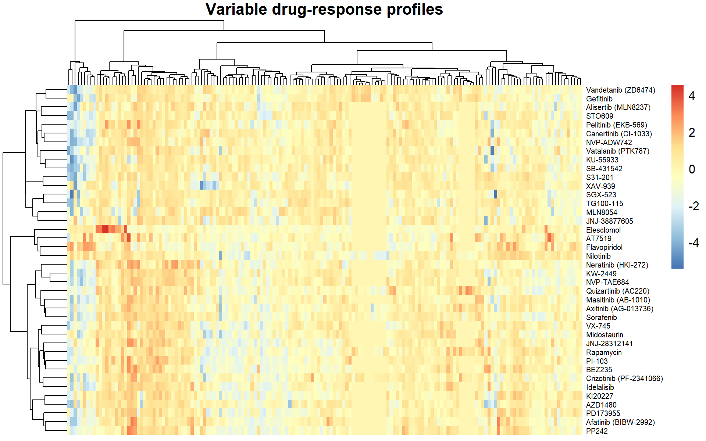

Heatmap of the 40 most variable drug-response profiles after row-scaling. Blocks of samples with consistently high or low scaled AUC indicate coordinated drug-sensitivity patterns — the exact signal that MOFA's drug-response factor aims to capture. Row-scaling ensures that inhibitors with different absolute AUC ranges contribute equally to the visual display rather than being dominated by the widest-range drugs.

**Drug Missingness Bar Chart**

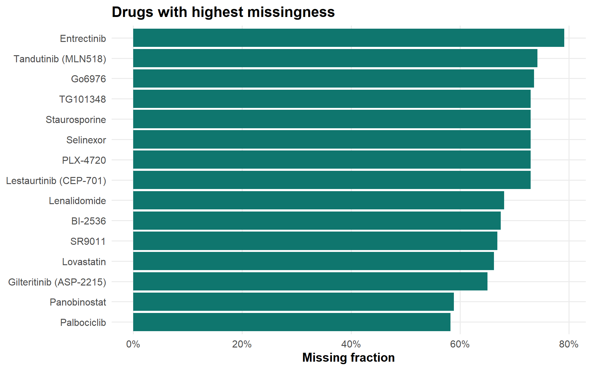

Inhibitor-level missingness is concentrated in a subset of drugs. Those exceeding the 20% missingness threshold are excluded before integration, as their observed values would represent a potentially biased subset of the cohort rather than a representative pharmacological profile.

**Drug Missingness Plot**

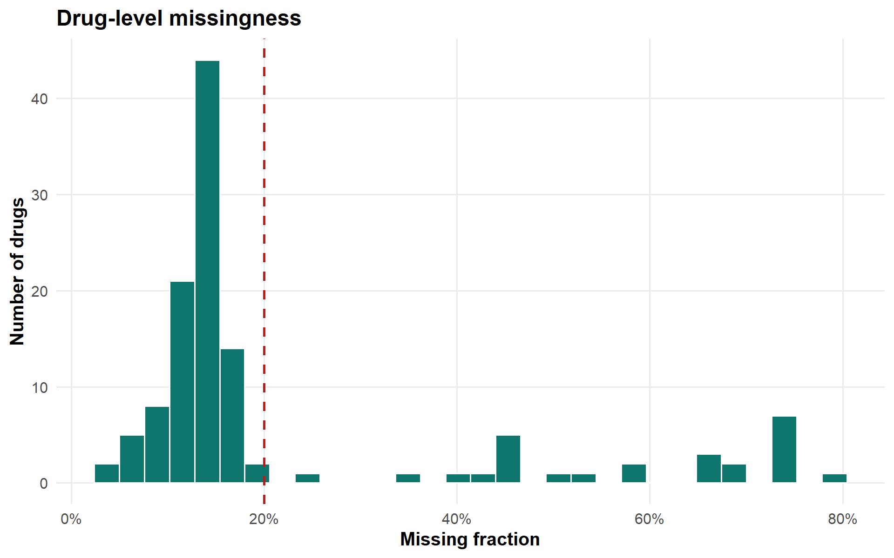

Sample-level drug missingness shows that some patients have no pharmacological measurements at all. These samples contribute to MOFA exclusively through their RNA and mutation views, with the entire drug AUC block treated as a missing view rather than as zeros.

**Drug PCA (PC1 vs PC2)**

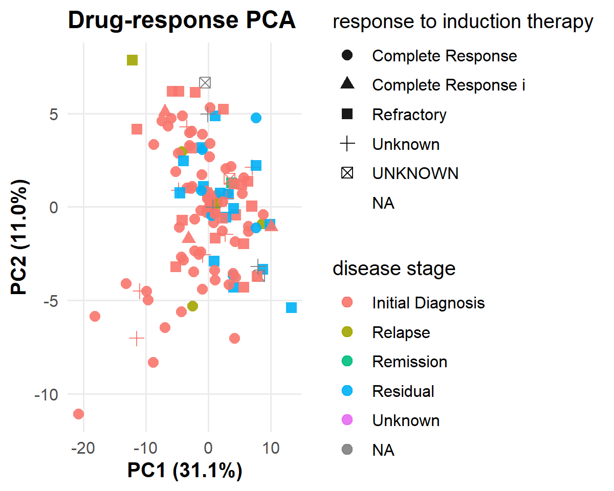

Drug PC1 typically explains the highest proportion of variance among all three views in AML pharmacological datasets, suggesting a broad, coordinated sensitivity-versus-resistance gradient across the cohort. The drug PCA should be interpreted cautiously with respect to clinical outcome without controlling for specimen type and prior treatment history.

**Drug Scree Plot**

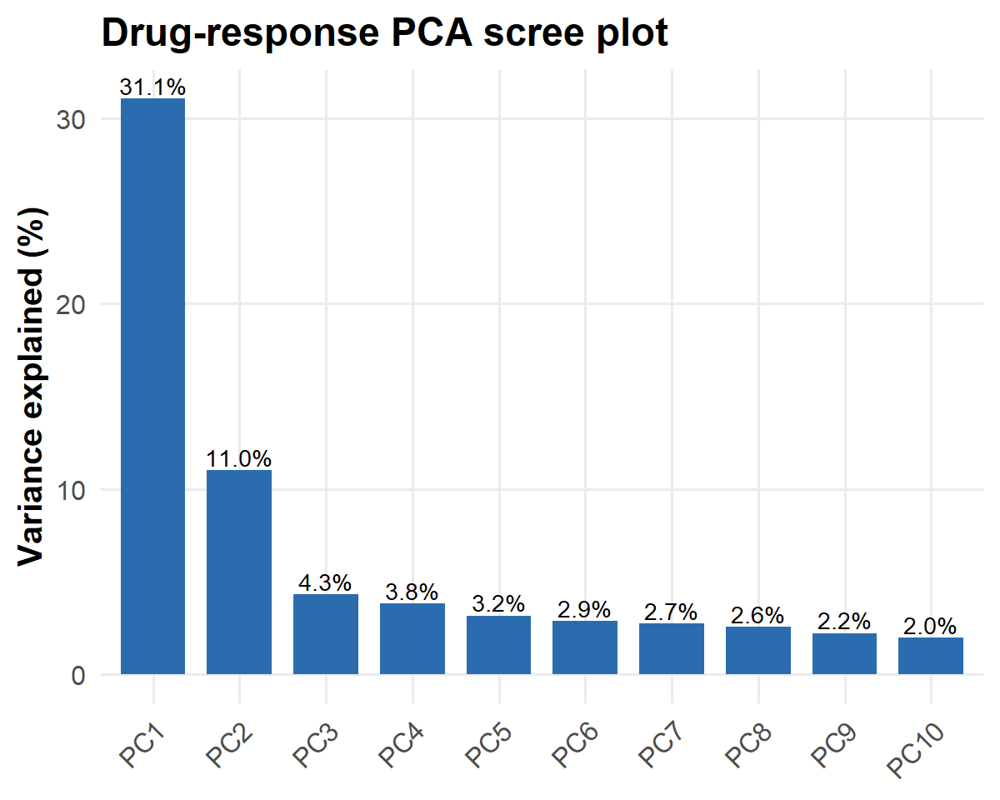

A steep initial drop with PC1 dominant indicates a strong leading drug-response gradient. Subsequent components capture secondary response patterns that may correspond to specific drug classes (e.g., BCL-2 inhibitors, kinase inhibitors) or to patient subgroups defined by underlying molecular features.

**Drug PCA Association Heatmap**

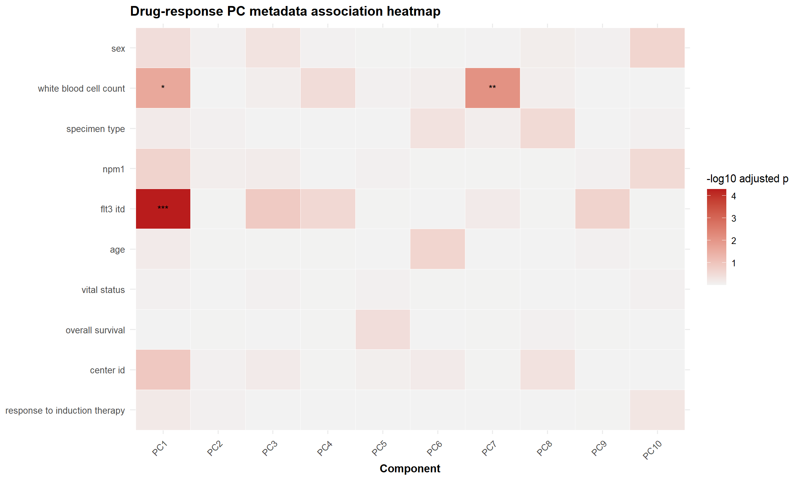

Metadata associations with drug PCs reveal whether clinical variables — disease stage, induction response, genotype — explain coordinated drug-sensitivity axes. Associations between drug PC1 and induction therapy response or FLT3-ITD status are biologically expected in AML and would support the pharmacological relevance of the leading drug axis.

**Drug UMAP**

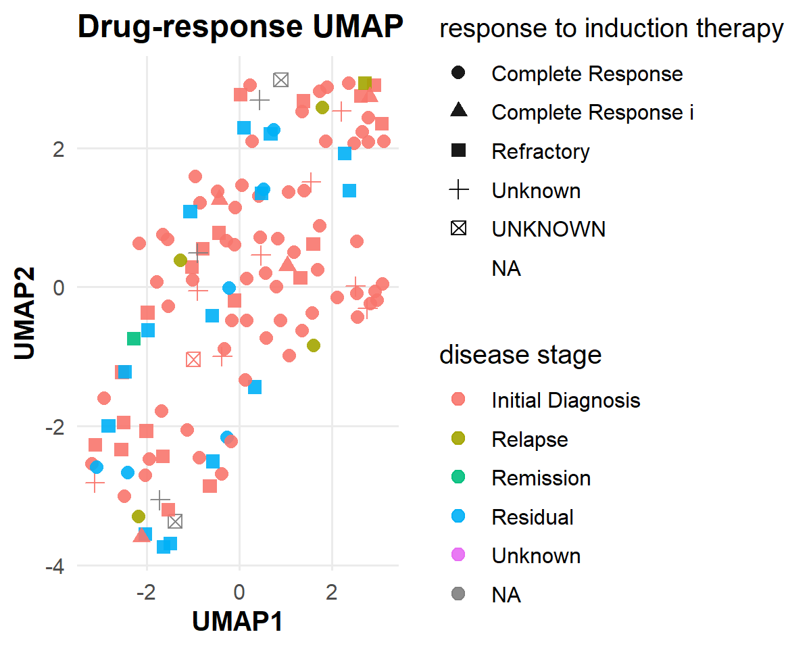

The drug-response UMAP projects pharmacological profiles into 2D using the first 10 drug PCs. Tight clusters indicate patient subgroups with highly similar ex vivo drug-sensitivity patterns, which may correspond to underlying molecular subtypes or clinical disease categories not captured by single-omics analysis.

**Drug UMAP with MNN Clusters**

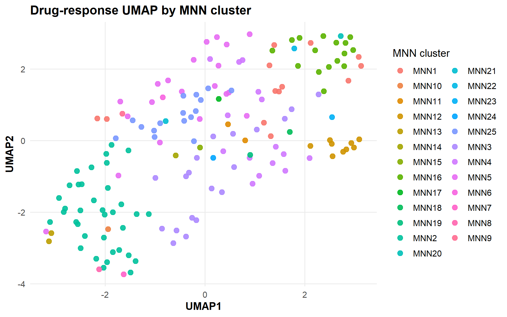

Mutual Nearest Neighbour (MNN) Louvain clusters overlaid on the drug UMAP. Each cluster represents patients whose drug-response profiles are mutually most similar in PCA space. These clusters are fully data-driven and do not rely on predefined clinical categories, making them useful for discovering novel pharmacological patient subgroups.

**Drug MNN PCA Overlay**

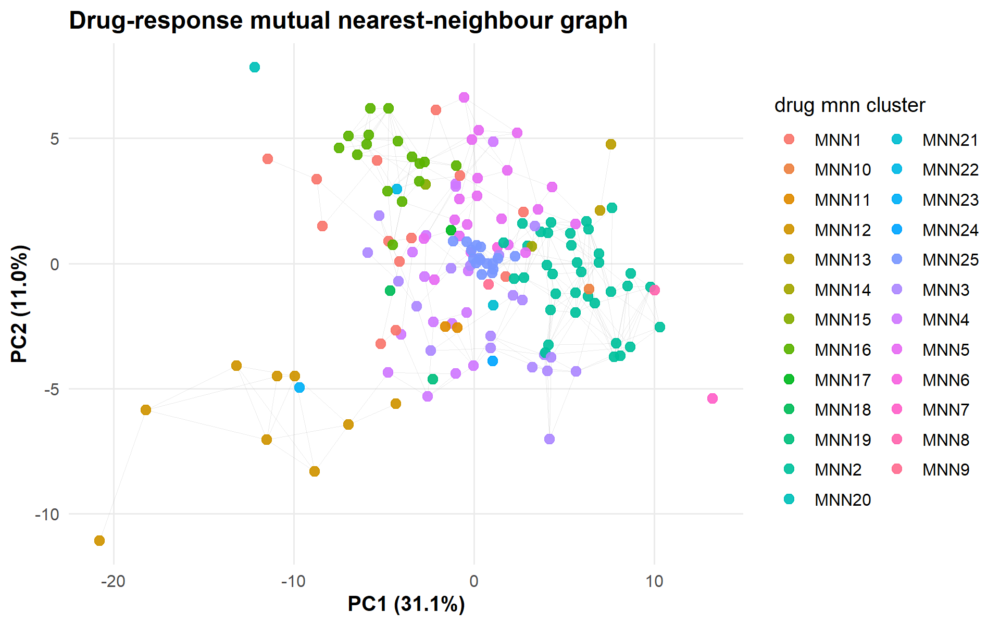

MNN edges connect samples that are each other's mutual k-nearest neighbours in drug PCA space. Tightly connected local communities form visible clusters, while peripheral samples with few edges are pharmacologically atypical relative to the rest of the cohort. The Louvain community assignments are carried forward for downstream colouring and enrichment testing.

---

### Cross-Omics PCA Comparison

**Combined PCA Metadata Association Heatmap**

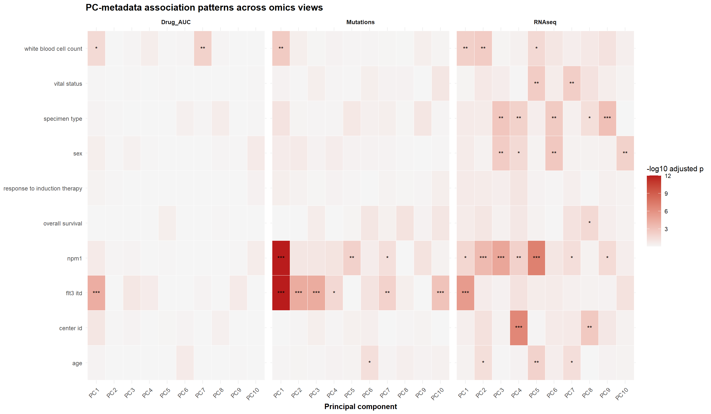

All three views' PC–metadata associations are shown simultaneously. Vertical stripes — a metadata variable appearing dark across multiple PCs and views — indicate pervasive biological or technical effects acting across all omics layers. View-specific dark tiles indicate factors captured only by one omics layer, which is precisely the type of view-specific signal that MOFA is designed to separate from shared cross-view factors.

**Cross-Omics PCA ANOVA / Kruskal-Wallis Comparison**

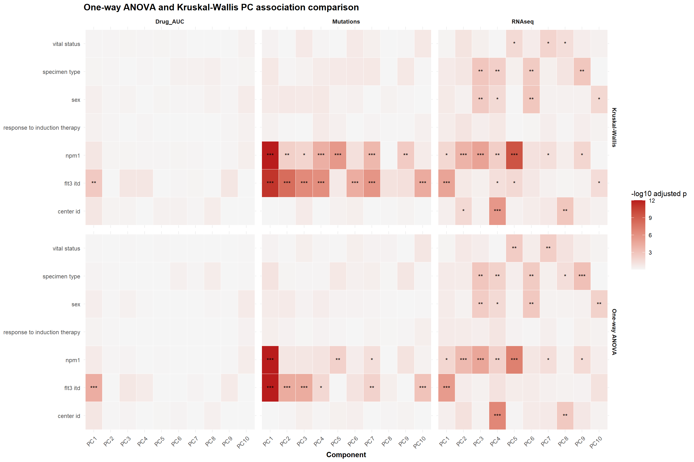

The side-by-side method comparison heatmap tests whether categorical metadata associations are supported by both ANOVA (group-mean testing) and Kruskal-Wallis (rank-based testing) across all three omics PCA spaces simultaneously. Concordance between both methods increases confidence in any given association; discordance suggests sensitivity to outliers, unequal group sizes, or non-normal score distributions.

---

### MOFA Factor Analysis

**MOFA Input Data Overview**

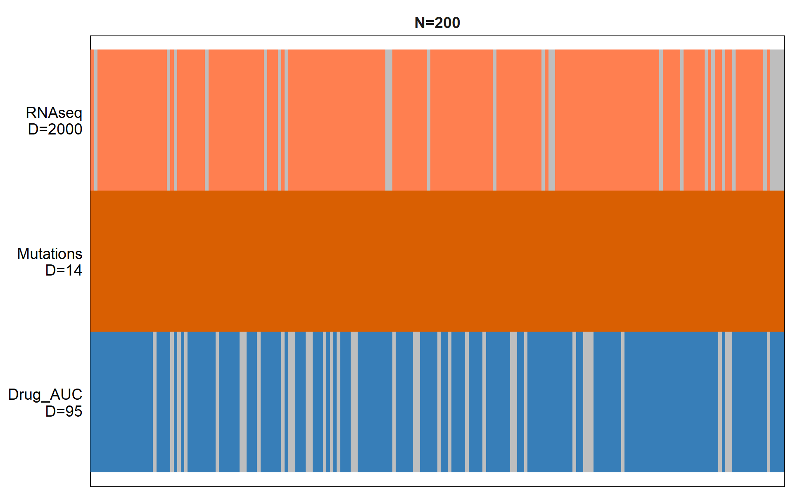

The MOFA input tile plot shows observed (coloured) and missing (white) blocks across all three views before training. The union-sample design means that partially observed samples are retained in the model. Complete-case samples — those present in all three views — contribute the most information to cross-view factors, while partial samples still inform view-specific factors.

**MOFA Total Variance Explained per View**

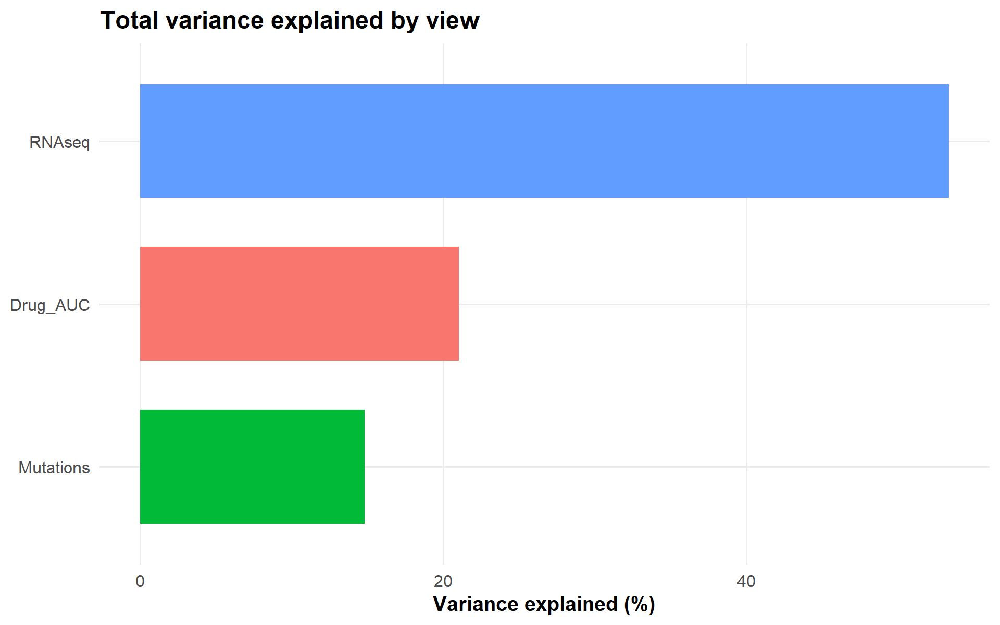

Total variance explained by all MOFA factors summed across each view. Views with high cumulative R² are well captured by the learned latent factors. A low total R² in a given view suggests that its variation is highly sample-specific, noise-dominated, or structured in ways not shared with the other views and not captured by the chosen number of factors.

**MOFA Per-Factor Variance Explained**

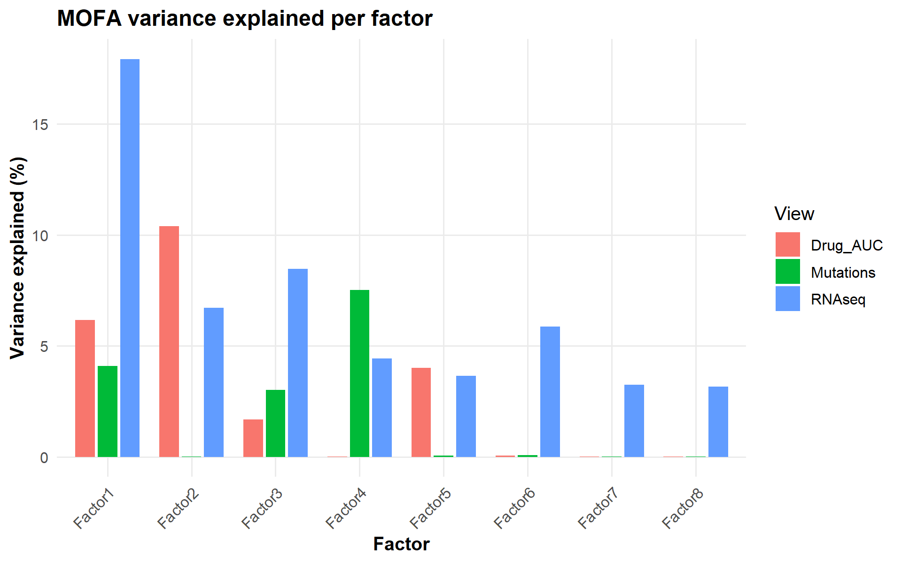

Each cell shows how much variance a given factor explains in a given view. **Multi-view factors** — those with non-trivial R² in two or more views — represent coordinated molecular programmes linking transcription, genotype, and drug response simultaneously. **View-specific factors** — high R² in only one view — capture within-view variation not shared across modalities and are best interpreted through the weights of that single view.

**MOFA Factor Scatter (Factor 1 vs Factor 2)**

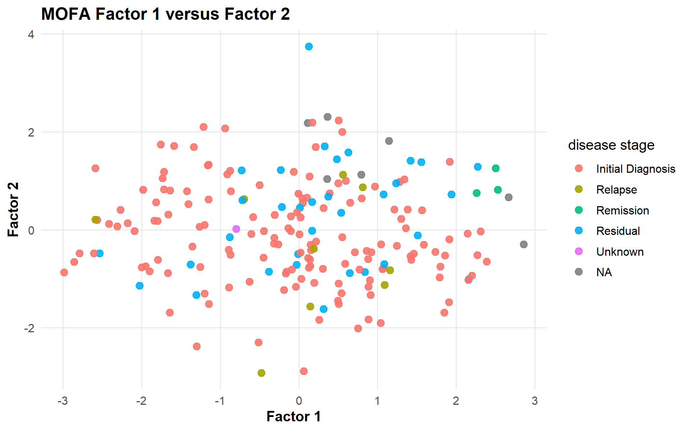

Sample positions in the integrated latent space spanned by the two strongest MOFA factors. Factor 1 is the strongest multi-view axis, supported by variance contributions from RNA-seq and Drug AUC with a smaller mutation contribution. Factor 2 captures secondary structured variation. Sample separation in this plot reflects integrated molecular and pharmacological heterogeneity — not any single omics layer — making it more informative than any individual PCA plot.

**MOFA Factor Heatmap**

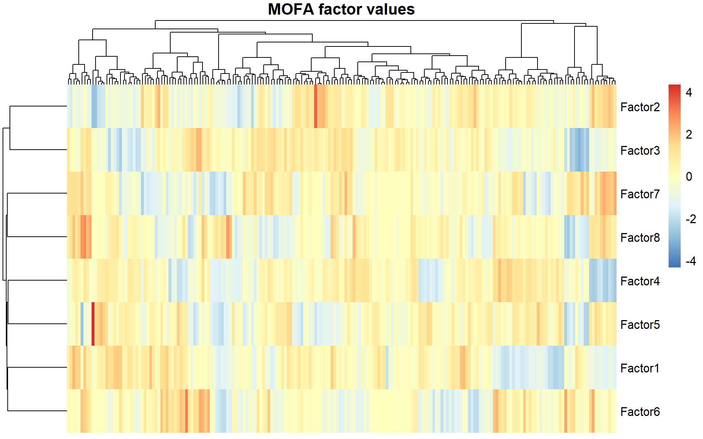

Sample scores across all learned MOFA factors, with rows representing factors and columns representing samples ordered by their Factor 1 score. Coordinated bands of high/low scores across multiple factors indicate patient subgroups defined simultaneously by multiple independent molecular axes. This pattern cannot be detected from any single-omics analysis and is one of the key outputs of the MOFA integration.

**MOFA Factor Metadata Distribution**

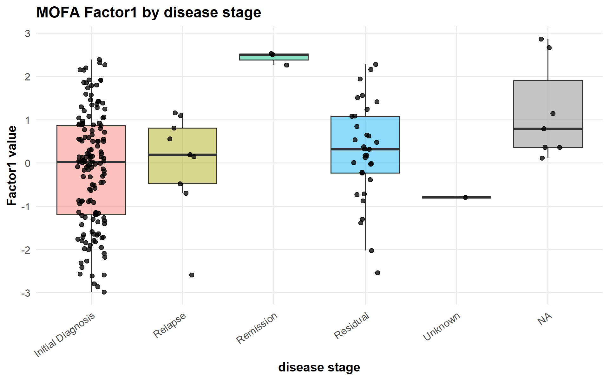

Box and jitter plots showing how the strongest MOFA factor score distributes across the primary metadata grouping variable. Clear separation between group boxes supports a biologically meaningful factor–metadata association. Overlapping boxes indicate that the factor is better characterised through its feature weights and continuous metadata associations than as a clean categorical variable.

**MOFA Feature Weights**

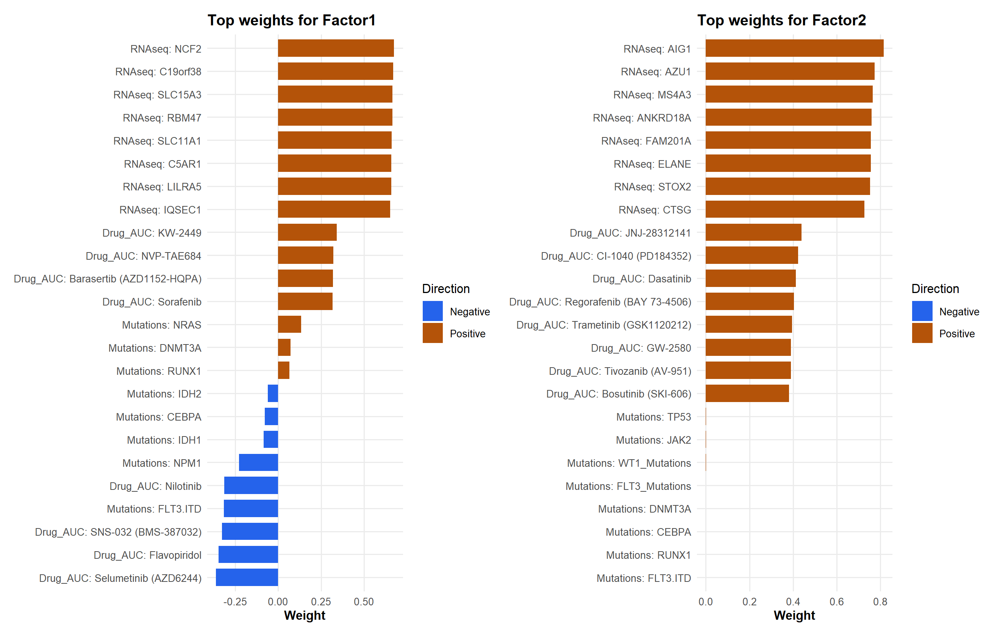

Top absolute feature weights for each MOFA factor showing which genes (RNA view), mutation events (Mutation view), and inhibitors (Drug AUC view) load most strongly. Positive weights indicate features elevated in samples with high factor scores; negative weights indicate features elevated in samples with low scores. The sign of a factor is arbitrary — only the magnitude and relative ordering of weights carries biological meaning.

**MOFA Factor–Metadata Association Heatmap**

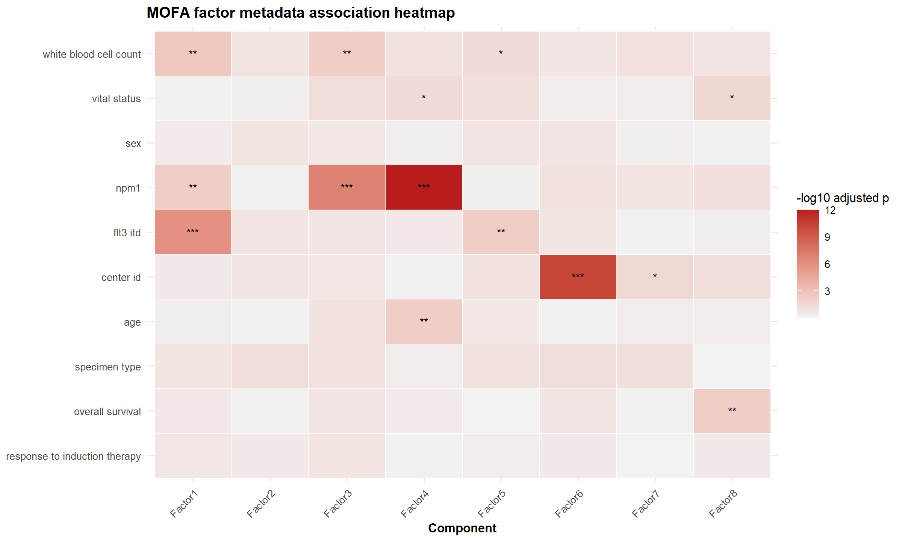

Dark cells indicate strong BH-adjusted associations between integrated MOFA factor scores and clinical metadata. Unlike single-omics PCA association heatmaps, a dark cell here means a **cross-omics latent factor** is linked to a clinical variable. Factors combining high multi-view variance explained with strong metadata associations are the most promising candidates for downstream biological validation and pathway enrichment analysis.

**MOFA ANOVA + Kruskal-Wallis Comparison Heatmap**

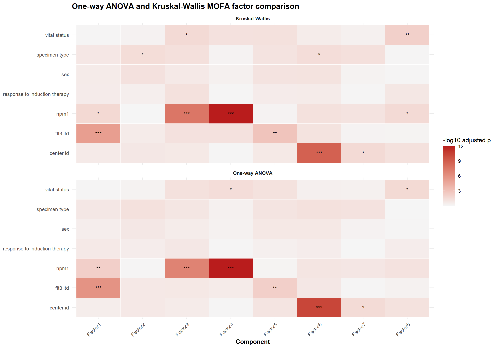

Dual-panel heatmap placing ANOVA and Kruskal-Wallis adjusted p-values side by side for all categorical metadata–factor pairs. Factors with dark tiles in **both** panels for the same metadata variable have the most robust categorical associations, supported by both parametric and non-parametric evidence.

---

## Conclusions

1. **RNA-seq** reveals a broad transcriptional landscape with variance distributed across multiple programmes, likely capturing cell state, disease stage, and specimen composition effects simultaneously. Library-size normalisation and VST are essential prerequisites before any distance-based analysis.

2. **Targeted mutation data** are sparse and event-driven. Recurrent AML driver genes (NPM1, FLT3-related events) dominate mutation PCA axes. Bernoulli likelihood modelling in MOFA is the statistically appropriate choice for binary 0/1 features over a Gaussian assumption.

3. **Drug AUC profiles** show the strongest leading PC among all three views, suggesting a coordinated sensitivity–resistance gradient across the pharmacological panel. Systematic missingness in the drug view is the main constraint limiting the number of samples available for complete cross-view integration.

4. **MOFA2 integration** identifies latent factors that are either shared across views (multi-omics factors) or specific to individual views. The strongest factor is supported by variance contributions from both RNA-seq and drug-response, suggesting a functional transcriptional programme that is mechanistically linked to ex vivo pharmacological sensitivity in AML.

5. **Statistical associations** using ANOVA and Kruskal-Wallis confirm that several MOFA factors and PCA components are non-randomly associated with clinical variables including disease stage, genotype status, and induction therapy response. All associations are exploratory given the unsupervised analysis framework and should be treated as hypotheses for experimental follow-up.

---

## Limitations

- **Sample size:** The complete-case intersection is smaller than individual assay sample counts; the union-sample MOFA approach partially mitigates this but does not fully resolve reduced power for cross-view factors
- **Targeted mutation panel:** Only recurrent hotspot genes are captured; copy-number alterations, clonal architecture, and epigenetic events are absent
- **Ex vivo pharmacology:** AUC measurements may not fully recapitulate in vivo drug sensitivity due to differences in tumour microenvironment, systemic pharmacokinetics, and stromal interactions
- **Confounding:** Specimen type, collection centre, prior treatment, and disease stage are not jointly adjusted for in the unsupervised analysis framework
- **MOFA is unsupervised:** Factors are not guaranteed to align with known clinical variables; biological interpretation should be supported by pathway enrichment of RNA weights, genotype validation, and independent replication
- **Preprocessing sensitivity:** HVG number (2,000), drug missingness threshold (20%), and likelihood assumptions (Gaussian/Bernoulli) all represent analytical choices that could be explored in a sensitivity analysis

---

## Reproducibility

```r
# Set working directory and run the master build script
source("make_MoBi_MultiOmic_4745778_Chua_report.R")
```

The build script will automatically:
1. Install all missing CRAN and Bioconductor packages
2. Create an isolated Python virtual environment (`.venvmofa`) and install `mofapy2`
3. Generate the Quarto/Rmd source file
4. Render the full HTML report via Quarto

**Seed:** All stochastic steps (UMAP, MOFA training, random sampling) use seed `4745778` for full reproducibility.
**MOFA model caching:** If `MoBiMultiOmic4745778Chua_mofamodel.hdf5` exists and the sample/view configuration has not changed, the saved model is reloaded rather than re-trained.

---

## Dependencies

### R (CRAN)
`tidyverse` · `ggplot2` · `pheatmap` · `matrixStats` · `patchwork` · `scales` · `janitor` · `readr` · `tibble` · `tidyr` · `dplyr` · `forcats` · `uwot` · `FNN` · `igraph` · `ggrepel` · `broom`

### R (Bioconductor)
`DESeq2` · `MOFA2`

### Python (via `.venvmofa`)
`numpy` · `scipy` · `pandas` · `scikit-learn` · `h5py` · `mofapy2`

### Software
- R ≥ 4.3
- Python ≥ 3.9
- Quarto (for `.qmd` rendering) or RStudio with bundled Quarto

---
